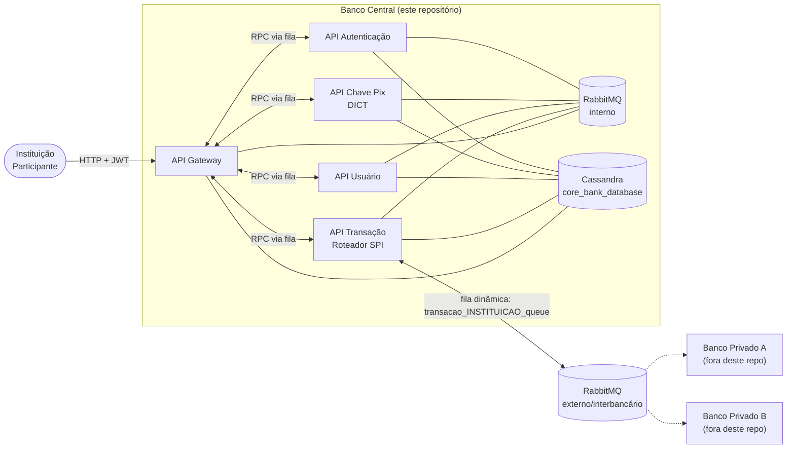

# 🏦 Core Banking System — SIN142

> Réplica distribuída do **PIX**, representando o papel do **Banco Central** no arranjo de pagamentos instantâneos.

Projeto acadêmico da disciplina de **Sistemas Distribuídos**. Este repositório implementa a infraestrutura central que autentica **instituições participantes**, mantém o **Diretório de Chaves PIX (DICT)** e **roteia transações** — decidindo se um pagamento é liquidado internamente (mesma instituição) ou encaminhado para outro banco participante, exatamente como o SPI/Bacen faz no PIX real.

> ⚠️ Os **bancos privados participantes** (que consomem as filas interbancárias) **não fazem parte deste repositório** — aqui vive somente o lado do Banco Central.

---

## 🧭 Sumário

- [Arquitetura](#-arquitetura)
- [Microsserviços](#-microsserviços)
- [Como o roteamento interbancário funciona](#-como-o-roteamento-interbancário-funciona)
- [Stack tecnológica](#-stack-tecnológica)
- [Estrutura do repositório](#-estrutura-do-repositório)
- [Como executar](#-como-executar)
- [Endpoints da API pública](#-endpoints-da-api-pública)
- [Deploy em Kubernetes](#-deploy-em-kubernetes)
- [Limitações conhecidas](#-limitações-conhecidas)

---

## 🏗 Arquitetura

O sistema é composto por microsserviços em **FastAPI** que se comunicam majoritariamente via **RabbitMQ** (padrão RPC: fila de request + fila de response correlacionadas por `correlation_id`), com o **Apache Cassandra** como armazenamento persistente compartilhado. O único ponto de entrada HTTP externo é o **API Gateway**, que traduz requisições REST em mensagens RabbitMQ e aguarda a resposta antes de devolver o resultado ao cliente.



**Fluxo típico de uma requisição:**

1. O cliente autentica uma **instituição** via `/auth/` e recebe um JWT.
2. Toda chamada subsequente ao Gateway carrega esse JWT (`Bearer`).
3. O Gateway publica uma mensagem `{"action": "...", ...}` na fila do microsserviço responsável, com `reply_to` e `correlation_id`.
4. O microsserviço processa a ação, lê/grava no Cassandra e publica a resposta na fila de retorno.
5. O Gateway recebe a resposta correlacionada e devolve o HTTP ao cliente.

---

## 🧩 Microsserviços

| Serviço | Papel no arranjo PIX | Fila (consome → responde) |
|---|---|---|
| **API_Gateway** | Porta de entrada HTTP única; valida JWT; cria o schema do Cassandra | publica em todas as filas de request |
| **API_Authenticacao** | Autentica **instituições participantes** (não usuários finais) e emite JWT | `auth_queue` → `auth_response_queue` |
| **API_Usuario** | CRUD de usuários finais (clientes das instituições) | `usuario_queue` → `usuario_response_queue` |
| **API_ChavePix** | Diretório de Chaves PIX (DICT) — cadastro e resolução de chaves | `chavepix_queue` → `chavepix_response_queue` |
| **API_Transacao** | Roteador central (SPI) — decide liquidação interna vs. interbancária | `transaction_queue` → `transaction_response_queue` |

### API_Gateway
Ponto único de entrada REST. No startup, cria o keyspace `core_bank_database` e as tabelas (`institutions`, `usuarios`, `usuarios_pix`, `transfers`). Não fala diretamente com nenhum outro serviço — tudo passa por RPC via RabbitMQ.

### API_Authenticacao
Recebe `institution_id` + `institution_secret`, valida o hash (`bcrypt`) contra a tabela `institutions` no Cassandra e emite um **JWT** (`HS256`, expiração de 30 min, claim `sub = institution_id`). É o Banco Central validando as credenciais dos bancos participantes.

### API_Usuario
CRUD (`create`, `delete`, `get`, `list`, `find_by_cpf`) de usuários finais na tabela `usuarios`.

### API_ChavePix
CRUD de chaves PIX (`create`, `delete`, `get`, `list`, `find_by_key`) na tabela `usuarios_pix`. A ação `find_by_key` faz um "join" manual entre `usuarios_pix` → `usuarios` → `institutions`, resolvendo uma chave PIX para a instituição dona — exatamente o papel do **DICT** no PIX real.

### API_Transacao
O núcleo do roteamento. Ao receber uma transação:
1. Resolve a chave PIX de destino no Cassandra (tabela `usuarios_pix`).
2. Compara a instituição de origem com a de destino.
3. **Mesma instituição** → liquidação interna.
4. **Instituições diferentes** → publica a transação em uma fila dinâmica `transacao_{instituicao_destino}_queue` em um **broker RabbitMQ externo**, simulando o envio ao banco participante de destino.

---

## 🔀 Como o roteamento interbancário funciona

O `API_Transacao` mantém duas conexões RabbitMQ distintas:

- **Broker interno** (`rabbitmq:5672`) — comunicação entre os microsserviços deste repositório.
- **Broker externo/interbancário** (`179.189.94.124:9080`) — onde, no mundo real desta simulação, cada banco participante consumiria sua própria fila dinâmica:

```python
external_channel.queue_declare(queue=f"transacao_{instituicao_destino}_queue", durable=True)
external_channel.basic_publish(
    routing_key=f"transacao_{instituicao_destino}_queue",
    body=json.dumps({
        "action": "transfer_inbound",
        "usuario_origem": ..., "usuario_destino": ...,
        "instituicao_origem": ..., "instituicao_destino": ...,
        "chave_pix": ..., "valor": ...,
    }),
    properties=pika.BasicProperties(
        reply_to=f"transacao_{instituicao_destino}_response_queue",
        correlation_id=properties.correlation_id,
    )
)
```

Como os bancos privados não estão neste repositório, essa fila é o **contrato de integração** — qualquer aplicação externa que consumir `transacao_{seu_id}_queue` no broker interbancário passa a atuar como um banco participante do arranjo.

---

## 🛠 Stack tecnológica

- **FastAPI** — framework HTTP dos microsserviços
- **RabbitMQ** (`pika`) — mensageria RPC entre serviços e entre instituições
- **Apache Cassandra** (`cassandra-driver`) — persistência distribuída
- **PyJWT** + **bcrypt** — autenticação e hash de credenciais das instituições
- **Docker** / **Docker Compose** — containerização local
- **Kubernetes** — orquestração em produção

---

## 📁 Estrutura do repositório

```
Core_Banking_System-SIN142/
├── APIs/
│   ├── API_Gateway/        # Porta de entrada HTTP / BFF
│   ├── API_Authenticacao/  # Autenticação de instituições
│   ├── API_Usuario/        # CRUD de usuários finais
│   ├── API_ChavePix/       # DICT — diretório de chaves PIX
│   └── API_Transacao/      # Roteador central de transações
├── deployment/              # Manifests Kubernetes (deployments + services)
├── docker-compose.yml       # Orquestração local dos serviços + RabbitMQ + Cassandra
├── deploy.sh / deploy.bat   # Build, push e deploy automatizados
└── deployCassandra.bat      # Sobe um Cassandra standalone auxiliar
```

Cada serviço em `APIs/` segue o mesmo padrão: `app/` (código), `Dockerfile` e `requirements.txt`.

---

## ▶️ Como executar

### Pré-requisitos
- [Docker](https://www.docker.com/get-started) e [Docker Compose](https://docs.docker.com/compose/)
- [Kubectl](https://kubernetes.io/docs/tasks/tools/) + cluster Kubernetes (apenas para deploy em produção)

### Subindo tudo localmente

```bash
docker-compose up --build
```

Isso sobe RabbitMQ, Cassandra e os 5 microsserviços. Portas expostas localmente:

| Serviço | Porta local |
|---|---|
| API Gateway | `8000` |
| API Autenticação | `30100` |
| API Transação | `30200` |
| API Chave Pix | `30300` |
| API Usuário | `30400` |
| RabbitMQ (AMQP) | `5672` |
| RabbitMQ Management | `15672` |
| Cassandra | `9042` |

### Fluxo mínimo de teste manual

```bash
# 1. Cadastrar uma instituição direto no Cassandra (fora do escopo da API pública)

# 2. Autenticar e obter o token
curl -X POST http://localhost:8000/auth/ \
  -H "Content-Type: application/json" \
  -d '{"instituicao_id": "<id>", "instituicao_secret": "<secret>"}'

# 3. Usar o token nas demais chamadas
curl http://localhost:8000/usuario/ -H "Authorization: Bearer <token>"
```

---

## 🌐 Endpoints da API pública

Todos expostos pelo **API_Gateway**; exceto `/` e `/auth/`, todos exigem `Authorization: Bearer <token>`.

| Método | Rota | Descrição |
|---|---|---|
| `GET` | `/` | Health check |
| `POST` | `/auth/` | Autentica uma instituição e retorna JWT |
| `POST` | `/usuario/` | Cria usuário final |
| `GET` | `/usuario/` | Lista usuários |
| `GET` | `/usuario/find/?cpf=` | Busca usuário por CPF |
| `DELETE` | `/usuario/{usuario_id}` | Remove usuário |
| `POST` | `/chave_pix/` | Cadastra chave PIX |
| `GET` | `/chave_pix/` | Lista chaves PIX |
| `GET` | `/chave_pix/find/?chave=` | Resolve chave PIX (usuário + instituição dona) |
| `DELETE` | `/chave_pix/{chave_id}` | Remove chave PIX |
| `POST` | `/transacao/` | Cria uma transação PIX (roteada interna ou externamente) |

---

## ☸️ Deploy em Kubernetes

```bash
kubectl apply -f deployment/deployment.yaml
kubectl apply -f deployment/service.yaml
kubectl apply -f deployment/rabbitmq-deployment.yaml
kubectl apply -f deployment/rabbitmq-service.yaml
kubectl apply -f deployment/cassandra-deployment.yaml
kubectl apply -f deployment/cassandra-service.yaml
```

Verificar status:

```bash
kubectl get pods
kubectl get services
```

Cada serviço é exposto via `NodePort`:

| Serviço | NodePort |
|---|---|
| API Gateway | `30000` |
| API Autenticação | `30100` |
| API Transação | `30200` |
| API Chave Pix | `30300` |
| API Usuário | `30400` |
| RabbitMQ Management | `31672` |

Os scripts `deploy.sh`/`deploy.bat` automatizam build + push das imagens Docker e aplicação dos manifests. O `deploy.bat` inclui ainda a subida de Cassandra/RabbitMQ standalone e a exposição pública do Gateway via Cloudflare Tunnel.

Remover todos os recursos criados:

```bash
kubectl delete all --all
```

---

## ⚠️ Limitações conhecidas

Por ser um projeto acadêmico, algumas simplificações e pendências existem propositalmente ou por dívida técnica:

- A tabela `transfers` é criada no schema, mas o histórico de transações ainda não é persistido nela.
- O fluxo de notificação ao **banco de origem** (`transfer_outbound`, débito) está implementado no `API_Transacao`, porém desativado — apenas o crédito ao destino (`transfer_inbound`) está ativo.
- Segredo JWT e credenciais do broker interbancário estão fixos no código, não parametrizados via variável de ambiente.
- Os `readinessProbe` de alguns deployments Kubernetes apontam para uma rota `/health` ainda não implementada.

---

## 👥 Contribuição

Contribuições são bem-vindas — abra uma *issue* ou envie um *pull request*.

## 📄 Licença

Este projeto é licenciado sob a **MIT License**.
